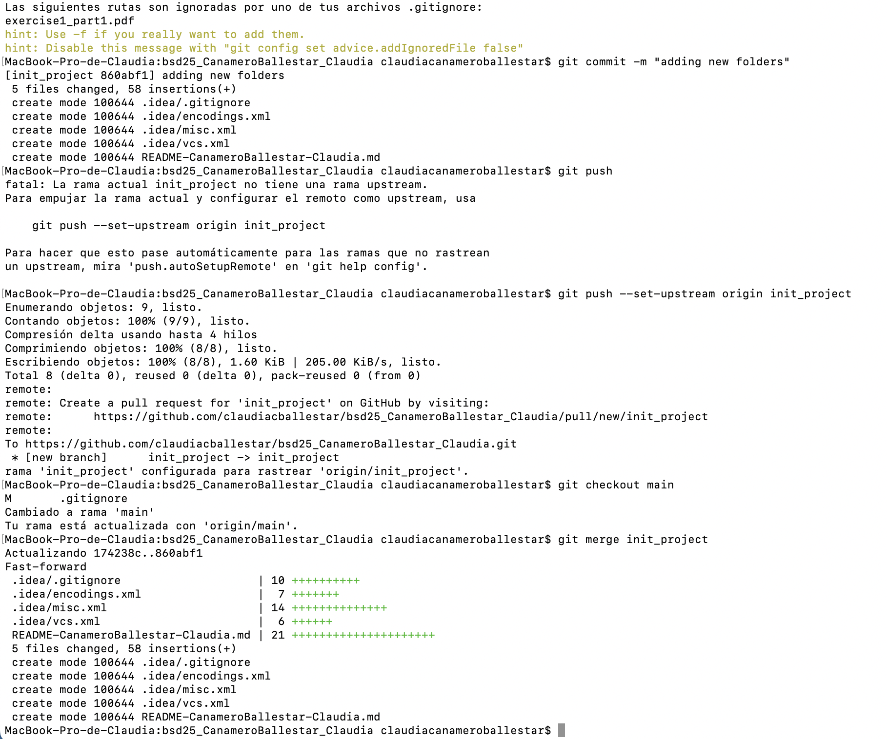
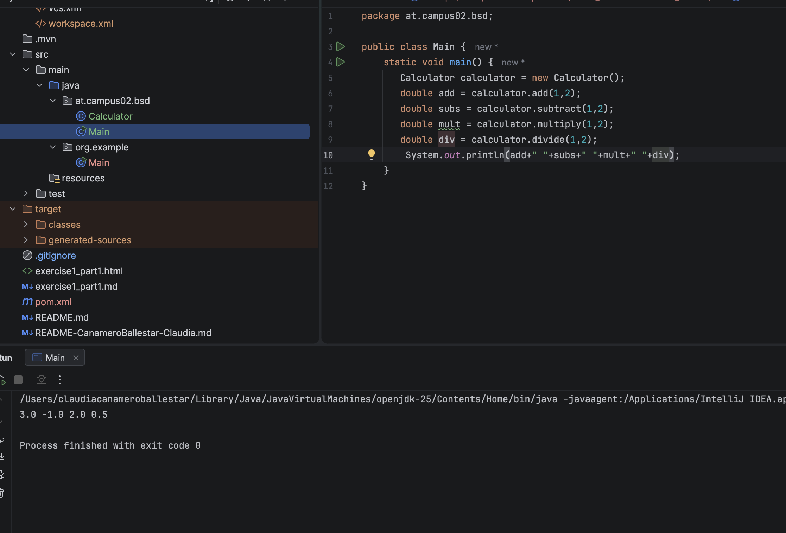
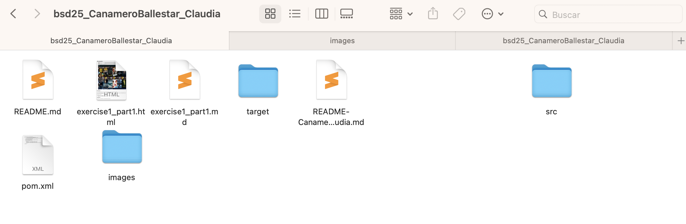
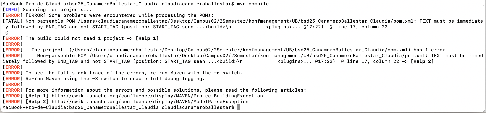
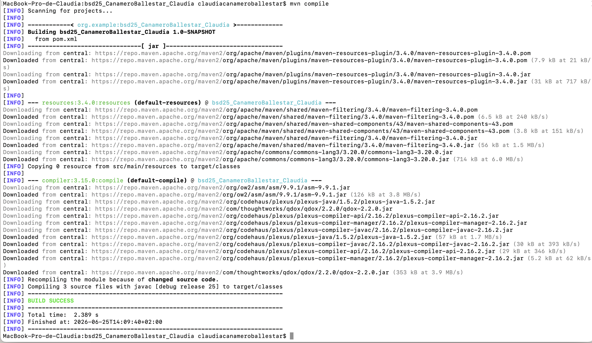
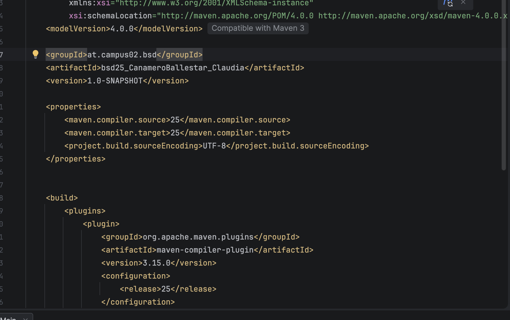
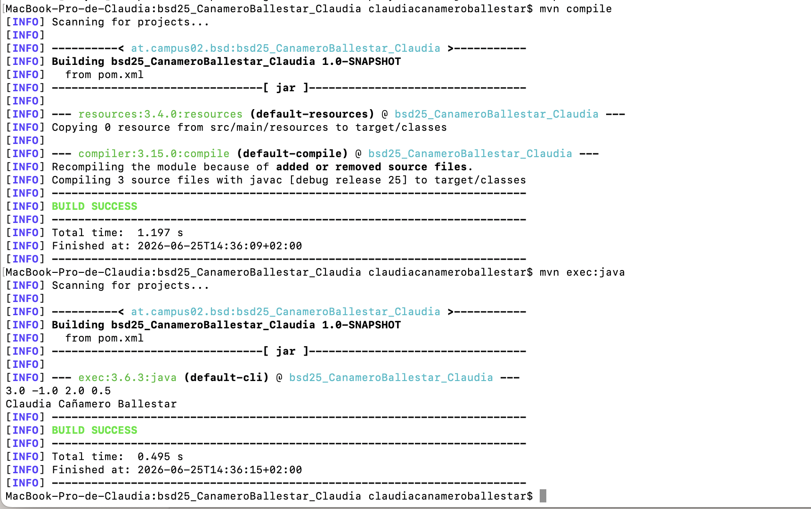

# Uebungsblatt 2

## New branch: init_project

- git branch init_project
- git remote add <name> <url>: add the current directory into github -> connects it
- git push --set-upstream origin <init_project> 
- git clone <url> 

### New project in IntelliJ: SAME NAME AS REPOSITORY

- important: in cloned folder (over)
- .gitignore: there will be one in .idea, another one outside: copy my informations into the outside one

### Main + init_project merge



- first checkout
- merge both branches

## New branch: calculator

- here I create the changes in the java project

### First compilation in Java 



- it appears a new folder: *target*

**here in Finder:**



### Compilation through Maven

- first: adding in the pom.xml the correct properties and plug-ins



error since the xml block was not correctly written



### Execute through Maven



I missed the name of the right project in the pom xml file



when it works properly, one can see perfectly here the sout from the java project

## New branch: loggin

### Log in .gitignore

Um	 zu	 verhindern,	 dass	 zukünftige	 Logdateien	 in	 der	 Versionsverwaltung	
- \*.log added into *.gitignore*

### adding a dependency: log4j2 

- [dependency management](https://logging.apache.org/log4j/2.x/manual/installation.html)

```java
<dependencyManagement>
  <dependencies>
    <dependency>
      <groupId>org.apache.logging.log4j</groupId>
      <artifactId>log4j-bom</artifactId>
      <version>2.26.0</version>
      <scope>import</scope>
      <type>pom</type>
    </dependency>
  </dependencies>
</dependencyManagement>
```
in *Main*

```java
private static Logger log = LogManager.getLogger(Main.class);

log.info("info");
        log.error("error");
```

*info:* not given through the console
*error:* given with a time stamp
in general in the code: it is shown who did changes and when clicking on the name, also in which day
there is a log tab: there one can check the different logs, in which repository (local and remote) and much more

### Configuration of the log4j2.xml file

[tutorial in youtube to support links](duck://player/_lc5mF2DVFY)
[tutorial with the code for xml](https://stackoverflow.com/questions/21206993/very-simple-log4j2-xml-configuration-file-using-console-and-file-appender)

- Add the change of the name in README file
- src/ressources -> add a file -> copy following code -> change file and append

### Creation of a .template file

- also mentioned in README

### Merge last branches and upload content
